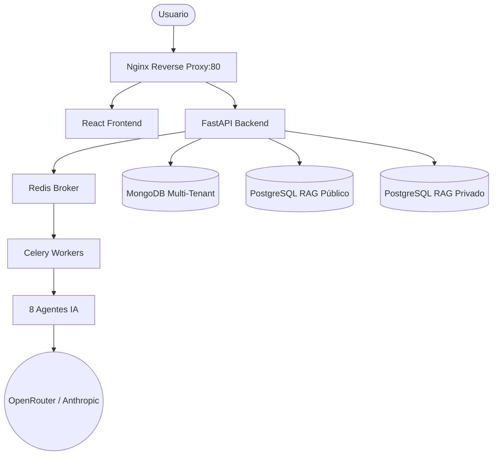
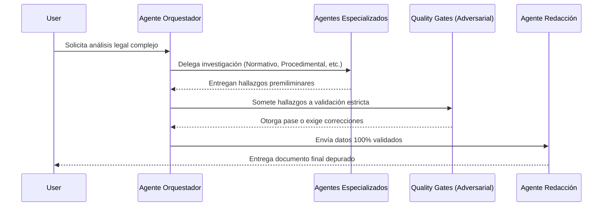

# Jurisconsultor: Sistema Multi-Agente para Asesoría Legal (v0.2)

Jurisconsultor es un sistema avanzado impulsado por inteligencia artificial diseñado para asistir a abogados y profesionales del derecho. En su versión 0.2, ha evolucionado de un modelo monolítico a una **Arquitectura Multi-Agente** especializada, logrando mayor precisión y reduciendo drásticamente las alucinaciones.

## Novedades en v0.2
- **Arquitectura Multi-Agente**: 8 agentes especializados (Orquestador, Normativo, Procedimental, Doctrina, Síntesis, Adversarial, Redacción y Document Manager).
- **Procesamiento Asíncrono**: Integración con **Celery** y **Redis** para manejar tareas complejas en segundo plano sin bloquear la aplicación. *Nota: `celery`/`redis` ya están en `requirements.txt`; el worker de Celery aún no está definido en `docker-compose.yml`, la ejecución actual del workflow es síncrona.*
- **Soporte Multi-LLM**: Integración nativa con **OpenRouter** y **Anthropic** (Claude), permitiendo flexibilidad en la elección del modelo de IA subyacente. *Nota: el modelo gratuito `openai/gpt-oss-20b:free` de v0.2 ya no existe en OpenRouter; un sustituto free probado es `minimax/minimax-m3:free` (configurable vía `LLM_MODEL_NAME`).*
- **Quality Gates**: 5 niveles de validación automatizada por un agente adversario para garantizar cero alucinaciones.

## Diagramas de Arquitectura y Flujo

### 1. Arquitectura del Sistema
El siguiente diagrama ilustra cómo interactúan los contenedores Docker y cómo el backend delega el trabajo pesado de IA a Celery/Redis.


### 2. Flujo de Trabajo Multi-Agente
Este diagrama de secuencia muestra el ciclo de vida de una consulta legal a través del ecosistema de agentes.


## Arquitectura (Multi-Tenant con Reverse Proxy)

El proyecto utiliza una arquitectura de microservicios contenerizada con Docker Compose, diseñada para un entorno multi-tenant.

-   **`proxy` (Nginx)**: Reverse proxy que enruta el tráfico al `frontend` o al `backend`. Es el único punto de entrada público.
-   **`frontend`**: Aplicación React que provee la interfaz de usuario.
-   **`backend`**: API central en FastAPI. Orquesta a los agentes de IA y gestiona las tareas de Celery.
-   **`redis`**: Broker de mensajes para encolar y gestionar las tareas asíncronas de los agentes.
-   **`postgres_public`**: Base de datos PostgreSQL que almacena vectores de documentos legales públicos (RAG).
-   **Bases de Datos por Tenant (Dinámicas)**: MongoDB para gestión de usuarios/proyectos y PostgreSQL para vectores privados.

## Configuración de Entorno (`.env`)

El proyecto utiliza archivos `.env` para gestionar variables de entorno sensibles y configuraciones específicas de cada entorno.

-   **`.env` (raíz del proyecto)**: Contiene variables de entorno globales y credenciales para las bases de datos de ejemplo (`tenant_a`) y las que se generen dinámicamente. **No debe ser versionado.**
-   **`jurisconsultor/.env.example`**: Ejemplo de configuración para el backend.
-   **`jurisconsultor/frontend/.env`**: Contiene la URL del backend para el frontend. **No debe ser versionado.**
-   **`jurisconsultor/frontend/.env.example`**: Ejemplo de configuración para el frontend.

## Flujo de Trabajo y Despliegue

### Prerrequisitos

-   Docker y Docker Compose.
-   Asegúrate de que tu archivo `.env` en la raíz del proyecto esté configurado. Puedes copiar `jurisconsultor/.env.example` y adaptarlo.

### Gestión de Tenants y Primer Inicio

El script `onboard_tenant.sh` automatiza la creación de nuevos tenants (compañías), incluyendo sus bases de datos y un usuario administrador inicial.

**Para crear tu primera compañía y usuario administrador:**

```bash
./onboard_tenant.sh "Nombre de tu Empresa" admin@tuempresa.com TuContraseñaSegura
```
**Ejemplo:**
```bash
./onboard_tenant.sh "Mi Primera Empresa" admin@miempresa.com P@ssw0rdSegur@123
```

Este script realizará las siguientes acciones:
1.  Generará credenciales seguras para las bases de datos del nuevo tenant.
2.  Actualizará el archivo `.env` en la raíz del proyecto con estas nuevas credenciales.
3.  Añadirá las definiciones de los servicios de base de datos del nuevo tenant a `docker-compose.override.yml`.
4.  Levantará o reiniciará todos los servicios de Docker Compose, incluyendo las nuevas bases de datos.
5.  Creará el usuario administrador especificado en la base de datos del nuevo tenant.

### Gestión de Usuarios

La creación y gestión de usuarios se puede realizar de dos maneras:

1.  **Desde la Interfaz de Usuario (UI) de la Aplicación (Recomendado para uso diario):**
    *   Inicia sesión en la aplicación (`http://10.29.93.10`) con un usuario que tenga rol `admin` o `project_lead`.
    *   Ve a la pestaña de "Panel de Administración".
    *   Haz clic en el botón "Crear Nuevo Usuario".
    *   Rellena los datos (Email, Contraseña, Nombre Completo) y selecciona el Rol deseado ("Admin", "Líder de Proyecto", "Miembro").
    *   Esta es la forma más amigable y segura para la gestión de usuarios una vez que la aplicación está funcionando.

2.  **Usando el Comando `docker exec` (Para configuración inicial o automatización):**
    *   Este método es útil para crear el primer usuario administrador después de una instalación limpia, o para scripts de automatización.
    *   El comando es:
        ```bash
        docker exec jurisbot-backend-1 python create_admin.py "email@empresa.com" "ContraseñaSegura" --full_name "Nombre Completo" --role "rol_deseado"
        ```
        Donde `rol_deseado` puede ser `admin`, `member` o `project_lead`.


### Reconstrucción y Reinicio General

Después de realizar cambios en el código (backend, frontend, proxy) o en la configuración de Docker Compose, ejecuta:

```bash
docker compose up -d --build
```
Esto reconstruirá las imágenes necesarias y reiniciará los servicios.

### Acceso a la Aplicación

Una vez que los servicios estén en funcionamiento, la aplicación será accesible a través del reverse proxy en el puerto 80. Si tu servidor tiene la IP `10.29.93.10`, la URL será:

**http://10.29.93.10**

Podrás iniciar sesión con las credenciales del usuario administrador que creaste con `onboard_tenant.sh`.

## Procesamiento de Documentos Públicos (RAG)

Para que el sistema RAG funcione con documentos públicos:

1.  **Coloca tus documentos PDF:** Copia todos los archivos PDF que deseas procesar en la carpeta **`jurisconsultor/documentos_legales`** en tu máquina host.
2.  **Ejecuta el script de migración de la base de datos:** Esto asegura que la tabla `documents` y `document_ownership` existan en PostgreSQL.
    ```bash
    docker exec jurisbot-backend-1 python db_migration.py public
    ```
3.  **Ejecuta el script de procesamiento:** Esto leerá los PDFs, generará embeddings y los almacenará en la base de datos.
    ```bash
    docker exec jurisbot-backend-1 python legal_scraper.py /docs public
    ```

---